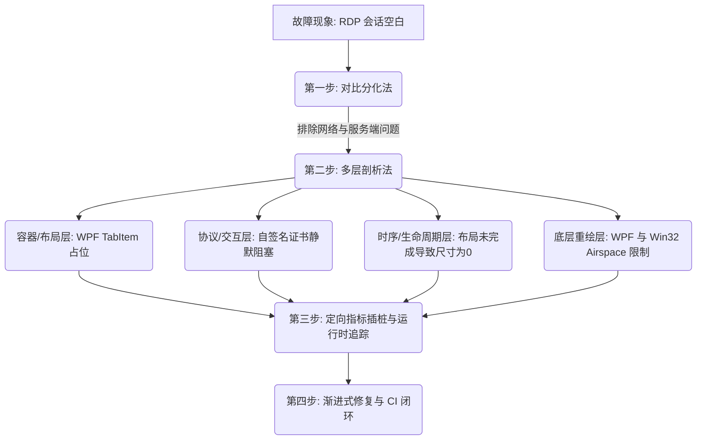

# 排查与定位复杂系统问题的方法论总结

本指南基于 **rdpManager WPF 客户端 RDP 会话空白画面问题** 的排查与定位过程，提炼出一套系统化、结构化的软件问题调试与诊断方法论。该方法论旨在帮助开发者在面对涉及跨技术栈（如 WPF、WinForms 嵌入、ActiveX 控件、Win32 底层 API 和网络安全协议）的复杂棘手问题时，能够迅速理清头绪、层层剥离，最终定位根因并精准修复。

---

## 核心排查步骤与思维模型

在面对复杂顽疾时，遵循“**对比-拆层-时序-桥接**”的诊断链条，能极大降低排查的盲目性。

---

## 一、 对比分化法（Differential Diagnosis）

**核心思想：通过寻找工作正常的“对照组”，将共性部分剔除，迅速收窄故障范围。**

* **应用实例**：
  * **故障表现**：在 `rdpManager` 中打开 RDP 标签页显示空白，无法进行远程控制。
  * **寻找对照组**：使用 Windows 自带的 `mstsc.exe` 连接相同 IP (`127.0.0.2`) 和端口。
  * **得出结论**：`mstsc.exe` 连接成功且画面操作正常。由此证明：
    1. 目标服务器的 RDP 服务运行正常；
    2. 本地网络、端口可达性以及凭据（用户名/密码）无误；
    3. **故障原因被完全锁定在 rdpManager 客户端内部，尤其是内嵌 ActiveX 控件的初始化、装载与渲染管道中。**

* **通用方法论**：
  * 永远不要在毫无线索的情况下重构整个调用链路。
  * 引入官方工具、标准命令行或成熟的第三方组件作为控制变量，明确是“协议端/服务端”问题，还是“客户端/包装器”问题。

---

## 二、 多层剖析法（Layered Stack Analysis）

**核心思想：跨技术栈混合编程中，问题往往跨越多个物理或逻辑层次。需要将系统分层，由浅入深进行逐层审查。**

在 RDP 空白屏问题中，我们最终定位了四个不同维度的根因，它们重叠在一起导致了“彻底空白”：

### 1. 容器与布局层（WPF Layout & Visual Tree）
* **排查点**：UI 控件是否真正存在于视觉树（Visual Tree）中？它的可见性（Visibility）与父容器是否正常？
* **案例发现**：
  * **Bug 1**：发现 `WorkspaceTabs` 的 `TabItem` 仅设置了 `Header`，其 `Content` 竟然为空（Blank），而真正的 `RdpClientControl` 被堆放在一个脱离 Tab 树的隐藏 `Grid` 里。
  * **Bug 2**：WPF 内嵌 WinForms 存在 **Airspace 限制**（WindowsFormsHost 永远漂浮在 WPF 层之上，`Opacity = 0` 根本无法隐藏它，切换 Tab 时会导致重叠显示）。
* **经验总结**：
  * 在 WPF/ActiveX 混编时，必须将 `Visibility` 设为 `Collapsed` 才能真正物理销毁/隐藏 HWND 窗口，仅靠 WPF 属性（如 `Opacity` 或 `Margin` 偏置）会产生渲染副作用。

### 2. 协议与安全交互层（Security & Protocol Handshake）
* **排查点**：嵌入式控件在遇到需要“安全确认”的场景时，是否因为缺乏交互界面而被默默挂起？
* **案例发现**：
  * 本地使用的 TermWrap 采用的是自签名证书（不受信任）。标准 `mstsc.exe` 遇到此类证书会弹出警告框让用户点击确认，但嵌入在 WPF 中的 ActiveX 控件没有默认弹窗机制。
  * 控件在握手阶段因为“证书不受信任”而**静默挂起**（Silent Hang），导致连接一直卡在握手态，表现为永久空白。
* **经验总结**：
  * 嵌入第三方控件时，必须审查其安全策略。对于内网/测试环境，必须通过代码显式配置 `AuthenticationLevel = 0`（忽略服务器身份验证）以绕过证书阻碍。

### 3. 时序与生命周期层（Timing & Lifecycle）
* **排查点**：在发起核心逻辑（如 Network Connect、API Call）时，宿主容器的物理尺寸是否已正确计算完毕？
* **案例发现**：
  * 原有逻辑使用 `DispatcherPriority.Loaded` 调度连接。然而在 `Loaded` 优先级触发时，`WindowsFormsHost` 及其包装的 ActiveX 容器可能尚未完成最终的尺寸测算（Measure & Arrange），使得底层句柄（HWND）以 `0×0` 的高宽尺寸进行初始化，导致渲染引擎判定无需绘图。
* **经验总结**：
  * 合理降低初始化调度优先级（例如调整为 `DispatcherPriority.Input`），确保界面布局彻底计算完毕后再执行复杂的 Win32 / ActiveX 连接逻辑。

### 4. 系统底层绘制层（OS Graphics & Paint Messaging）
* **排查点**：WPF 的虚拟渲染管道与 Win32 的像素渲染管道是否连通？
* **案例发现**：
  * WPF 的 `InvalidateVisual()` 仅仅要求 WPF 渲染线程重绘。但这对于 WinForms 控件中包裹的 Win32 HWND 没有任何用处——WPF 的刷新消息无法传递给底层的 `WM_PAINT` 消息循环。
  * 当 Tab 发生切换再切回时，ActiveX 无法获得重绘通知，导致遗留上一帧或者彻底白屏。
* **经验总结**：
  * 使用 P/Invoke 引入 Win32 原生 API `RedrawWindow`，在“切换 Tab 激活”、“连接成功回调”等关键生命周期点，强行向窗口句柄（Handle）发送重绘指令（如指定 `RDW_INVALIDATE | RDW_UPDATENOW` 标志），击穿 Airspace 阻碍。

---

## 三、 定向插桩与追踪（Targeted Instrumentation）

**核心思想：对于高度封装的“黑盒”组件（如微软的 MsTscAx 控件），无法查看源码时，必须通过在关键生命周期点打印特定指标来还原状态。**

* **关键指标清单**：
  * **句柄状态**：是否分配了 HWND 句柄？（如 `this.IsHandleCreated` 状态）
  * **几何尺寸**：当前控件的实际宽高（`ActualWidth`、`ActualHeight`）以及底层 Handle 的物理尺寸是否为非零正数？
  * **错误回调**：是否注册了所有的失败和异常事件？（如 `OnConnecting`、`OnConnected`、`OnDisconnected`、`OnFatalError`、`OnWarning` 等）。很多时候，连接早已断开，但由于没有捕获事件，导致表面上看起来仅仅是“空白”。

---

## 四、 渐进式修复与 CI 验证（Incremental Iteration & CI Validation）

**核心思想：单次只解决一个维度的变量，小步快跑，借助自动化编译系统（CI）快速验证，杜绝盲目修改。**

* **应用实例**：
  * **编译期障碍**：排查过程中引入 `BitmapPeristenceActive` 导致编译失败。发现其根本原因是微软 RDP ActiveX 控件的接口设计存在历史遗留拼写错误（拼写成了 `BitmapPeristence`，漏了第二个 `s`，且该属性位于基类接口而非高级接口中）。
  * **对策**：如果一次性修改太多代码，将很难分清是语法拼写错误还是渲染逻辑问题。通过每次提交一小部分改动，并密切监控 GitHub Actions 的编译流水线状态，确保基础代码正确后，再调整渲染细节。

---

## 总结：排查决策树（Quick Action Template）

当遇到类似“内嵌控件/第三方库不显示画面、不响应操作”的复杂情况时，可直接套用以下决策表：

| 检查维度 | 具体检查动作 | 期望结果与修正方案 |
| :--- | :--- | :--- |
| **1. 物理存在性** | 使用 Snoop 或 Live Visual Tree 检查控件是否在 UI 树中 | 若不在：修正布局层次，不能挂在未挂载的空 Grid 里。 |
| **2. 物理可见性** | 检查该控件的高、宽是否大于 0；是否被上层 WPF 元素遮挡 | 若宽高为 0：延迟初始化时序（调低 Dispatcher 优先级）。 若被遮挡：隐藏非活动 Tab 时必须用 `Visibility = Collapsed`。 |
| **3. 交互阻碍性** | 检查该控件是否在后台静默等待输入/弹窗（如安全证书、防火墙） | 显式降低安全身份验证级别（如 `AuthenticationLevel = 0`）以静默通过。 |
| **4. 绘制阻碍性** | 切换焦点/缩放时，像素是否能更新 | 若否：通过 P/Invoke 直接向 HWND 句柄发送 `RedrawWindow` |
| **5. 接口拼写陷阱** | 检查 COM 组件、ActiveX 的拼写是否符合特殊历史规范（如 `BitmapPeristence`） | 仔细查阅官方 API 元数据，避免被命名规范所误导。 |

通过以上系统性的诊断步骤，我们可以快速突破看似杂乱无章的重合问题，直击最底层的技术痛点。
